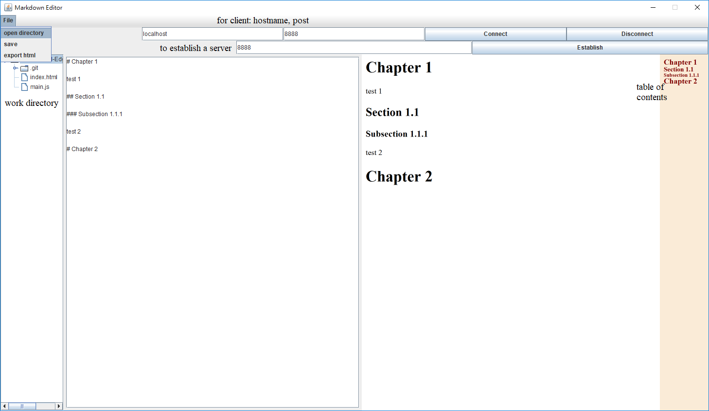

# Markdown shared editor

3160100052 陈翰逸 计算机科学与技术


## jar

https://pan.zju.edu.cn/share/c99129882ee35058548cf986df

https://github.com/chanhanyi0923/markdown/releases/download/1.1/MarkdownEditor-3160100052.jar


## 效果图




## 功能简述

依照课程要求，本次作业实现了以下功能：

- 能编辑Markdown文档
- 能在编辑区的左侧看到实时的文档目录
- 能保存和打开Markdown文档
- 能输出html
- 能建立一个网络服务，以供其他编辑器连接
- 能连接其他编辑器，连接后可编辑对方正在编辑的文档
- 连接了其他编辑器后，能实时同步反映服务器上的文件在其他编辑器上的修改
- 能实时在编辑区右侧看Markdown渲染后的效果<span style="color:red">(加分项)</span>


## 架构

- 图形界面用Swing实现
- 网络服务用Socket实现
- 文件服务用Apache的VFS实现
- 实现了一个```Text```类，作爲数据的模型，图形丶文件丶网络服务都是跟```Text```沟通而不是互相操作。


## Text

```Text```类有几个方法

```Java
public Client getClient();
public void setContent(String content);
public String toHtml();
public String getContent();
public void setTextAreaPanel(TextAreaPanel textAreaPanel);
public void setWebPanel(WebPanel webPanel);
public void textUpdated(String content);
```

值得注意的是，```textUpdated```（文字被外部数据更新）与```setContent```（文字被用户更新）这两件事情是不能同时发生的，因爲比如用户输入一个字，传到服务端再传回客户端，会形成一个循环，因此这里用了```Semaphore```解决。


## 目录树

1. 建立目录树

Java的```File```类有个```listFiles```方法，可以列出当前目录内容，就像```ls```命令一样，因此可以递归的调用，插入```DefaultMutableTreeNode```类的对象。

2. 监听文件系统的变化

Apache的VFS(Virtual File System, 虚拟文件系统)类实现了```FileChangeEvent```, ```FileListener```这些类，只要调用他的接口，当事件触发时，重新建立树形结构。


## 网络服务

主要使用了Java的Socket类，Client端用一个thread收丶发数据，Server端用```while (true)  Socket socket = serverSocket.accept();```接受连接，然後对於每一个连接建立一个綫程。


## Markdown

1. 解释器

用第三方库CommonMark，用它提供的```Parser```类输出HTML。

2. 实时渲染

JavaFX提供了一个元件```WebView```，可以实现简单的HTML渲染，每次内容更新之後也一并更新```WebView```的内容。

3. 建立实时文档目录

每次更新完```WebView```顺便用```jsoup```把渲染出的html用selector选h1到h6，放到第二个WebView。

## 第三方库


- JavaFX
  https://openjfx.io/
- CommonMark
  https://commonmark.org/
- Apache Commons VFS － Commons Virtual File System
  https://commons.apache.org/proper/commons-vfs/
- jsoup: Java HTML Parser
  https://jsoup.org

